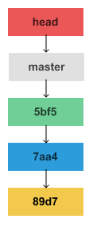
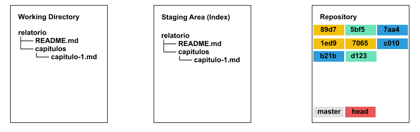
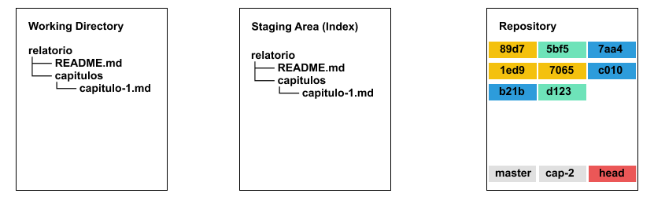
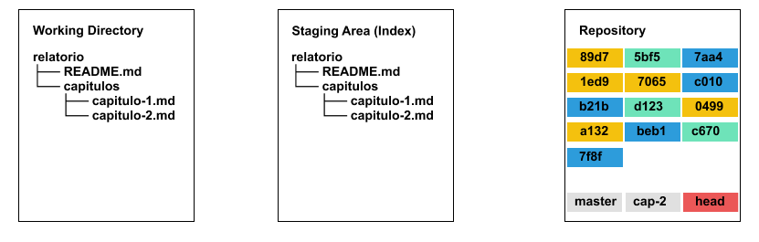
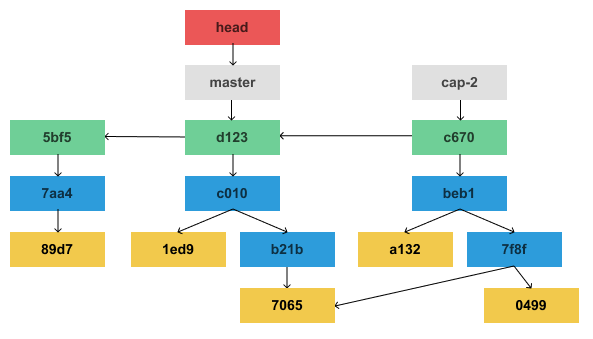
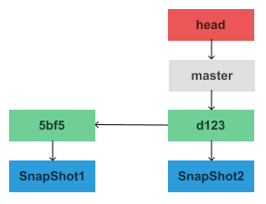
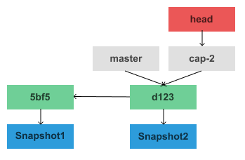
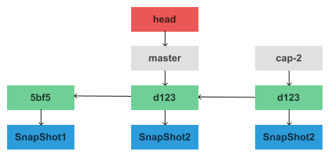
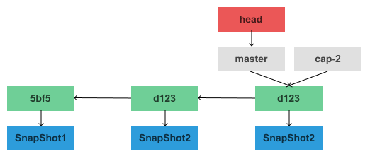

# Trabalhando com branchs

## Versão 1
---

```
$ git init relatorio
$ cd relatorio
$ code README.md
$ git add README.md
$ git commit -m 'primeira versão do relatório'
```




```
$ git log --oneline
d12305b (HEAD -> master) adicionando o capítulo 1
```

## Versão 2
---

```
$ code README.md
$ code capitulos/capitulo-1.md
$ git add README.md capitulos/capitulo-1.md
$ git commit -m 'adicionando o capítulo 1'
```




```
$ git log --oneline
d12305b (HEAD -> master) adicionando o capítulo 1
5bf530e primeira versão do relatório
```

## Criando a branch `cap-2`
---

```
$ git checkout -b cap-2
Switched to a new branch 'cap-2'
```




```
$ git log --oneline --graph --decorate
* d12305b (HEAD -> master, cap-2)adicionando o capítulo 1
* 5bf530e primeira versão do relatório
```

## Versão 3
---

```
$ code README.md
$ code capitulos/capitulo-2.md
$ git add README.md capitulos/capitulo-2.md
$ git commit -m 'adicionando o capítulo 2'
```




## Merge do `cap-2` para o `master`
---

```
$ git checkout master
```



```
$ git merge cap-2
```


## Resumindo
---

### Versão 1

<br>

### Versão 2



### Criando a branch `cap-2`



### Versão 3


### Merge do `cap-2` para o `master`


