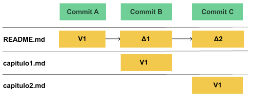
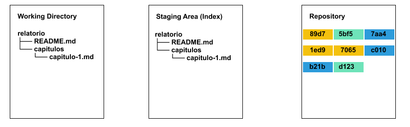

# Git

## Sistema de versionamento
---

### Diffs



### Versões


## Versão 1
---

### Inicializando um repositório

```
$ git init relatorio
$ cd relatorio
```

```
$ ls -a
.    ..   .git
```


### Configurando o repositório

```
$ git config --local user.name "Nome Sobrenome"
$ git config --local user.email nome@email.com
```

### Criando arquivos

`README.md`:

```
# Relatório
```


```
$ git status
On branch master

No commits yet

Untracked files:
  (use "git add <file>..." to include in what will be committed)

        README.md

nothing added to commit but untracked files present (use "git add" to track)
```

### Adicionando o `README.md` ao Stage Area

```
$ git add README.md
```


```
$ git status
On branch master

No commits yet

Changes to be committed:
  (use "git rm --cached <file>..." to unstage)

        new file:   README.md

```

### Criando a Versão 1

```
$ git commit -m 'primeira versão do relatório'
[master (root-commit) 5bf530e] primeira versão do relatório
 1 file changed, 1 insertion(+)
 create mode 100644 README.md
```


```
$ git status
On branch master
nothing to commit, working tree clean
```

### Exibindo a versão criada

```
$ git log
commit d12305b51ecabcb7af0c009778d76e0f5fc7cb8b (HEAD -> master)
Author: Luiz Carlos Rodrigues Chaves <lucachaves@gmail.com>
Date:   Sun Oct 28 02:12:05 2018 -0300

    adicionando o capítulo 1
```


## Versão 2
---

### Editando arquivos

`README.md`:
```
# Relatório

* [Capítulo 1](capitulos/capitulo-1.md)
```

`capitulos/capitulo-1.md`:
```
# Capítulo 1
```


```
$ git status
On branch master
Changes not staged for commit:
  (use "git add <file>..." to update what will be committed)
  (use "git checkout -- <file>..." to discard changes in working directory)

        modified:   README.md

Untracked files:
  (use "git add <file>..." to include in what will be committed)

        capitulos/

no changes added to commit (use "git add" and/or "git commit -a")
```

### Adicionando arquivos ao Stage Area

```
$ git add README.md capitulos/capitulo-1.md
```


```
$ git status
On branch master
Changes to be committed:
  (use "git reset HEAD <file>..." to unstage)

        modified:   README.md
        new file:   capitulos/capitulo-1.md

```

### Criando a Versão 2

```
$ git commit -m 'adicionando o capítulo 1'
[master d12305b] adicionando o capítulo 1
 2 files changed, 4 insertions(+), 1 deletion(-)
 create mode 100644 capitulos/capitulo-1.md
```



```
$ git status
On branch master
nothing to commit, working tree clean
```

### Exibindo a versão criada

```
$ git log
commit d12305b51ecabcb7af0c009778d76e0f5fc7cb8b (HEAD -> master)
Author: Luiz Carlos Rodrigues Chaves <lucachaves@gmail.com>
Date:   Sun Oct 28 02:12:05 2018 -0300

    adicionando o capítulo 1

commit 5bf530e9db9d8489f1822bdd41f04302095dfd03
Author: Luiz Carlos Rodrigues Chaves <lucachaves@gmail.com>
Date:   Sun Oct 28 00:37:59 2018 -0300

    primeira versão do relatório
```


```
$ git log --oneline
d12305b (HEAD -> master) adicionando o capítulo 1
5bf`530e primeira versão do relatório
```

## Versão 3
---

### Editando arquivos

README.md
```
# Relatório

* [Capítulo 1](capitulos/capitulo-1.md)
* [Capítulo 2](capitulos/capitulo-2.md)
```

capitulos/capitulo-2.md
```
# Capítulo 2
```


```
$ git status
On branch cap-2
Changes not staged for commit:
  (use "git add <file>..." to update what will be committed)
  (use "git checkout -- <file>..." to discard changes in working directory)

        modified:   README.md

Untracked files:
  (use "git add <file>..." to include in what will be committed)

        capitulos/capitulo-2.md

no changes added to commit (use "git add" and/or "git commit -a")
```

### Adicionando arquivos ao Stage Area

```
$ git add README.md capitulos/capitulo-2.md
```


```
$ git status
On branch cap-2
Changes to be committed:
  (use "git reset HEAD <file>..." to unstage)

        modified:   README.md
        new file:   capitulos/capitulo-2.md
```

### Criando a Versão 3

```
$ git commit -m 'adicionando o capítulo 2'
[cap-2 c670a06] adicionando o capítulo 2
 2 files changed, 3 insertions(+), 1 deletion(-)
 create mode 100644 capitulos/capitulo-2.md
```


```
$ git status
On branch cap-2
nothing to commit, working tree clean
```

### Exibindo a versão criada

```
$ git log
commit c670a06683623ec87011b39615edba9b0a9d9862 (HEAD -> cap-2)
Author: Luiz Carlos Rodrigues Chaves <lucachaves@gmail.com>
Date:   Sun Oct 28 04:18:42 2018 -0300

    adicionando o capítulo 2

commit d12305b51ecabcb7af0c009778d76e0f5fc7cb8b (master)
Author: Luiz Carlos Rodrigues Chaves <lucachaves@gmail.com>
Date:   Sun Oct 28 02:12:05 2018 -0300

    adicionando o capítulo 1

commit 5bf530e9db9d8489f1822bdd41f04302095dfd03
Author: Luiz Carlos Rodrigues Chaves <lucachaves@gmail.com>
Date:   Sun Oct 28 00:37:59 2018 -0300

    primeira versão do relatório
```


```
$ git log --oneline
c670a06 (HEAD -> cap-2) adicionando o capítulo 2
d12305b (master) adicionando o capítulo 1
5bf530e primeira versão do relatório
```

```
$ git log --oneline --graph --decorate
* c670a06 (HEAD -> cap-2) adicionando o capítulo 2
* d12305b (master) adicionando o capítulo 1
* 5bf530e primeira versão do relatório
```

## Resumindo
---

### Versão 1

```
$ git init relatorio
```


```
Criando o README.md
```


```
$ git add README.md
```


```
$ git commit -m 'primeira versão do relatório'
```


### Versão 2

```
Editando o README.md e capitulos/capitulo-1.md
```


```
$ git add README.md capitulos/capitulo-1.md
```


```
$ git commit -m 'adicionando o capítulo 1'
```


### Versão 3

```
Editando o README.md e capitulos/capitulo-1.md
```


```
$ git add README.md capitulos/capitulo-2.md
```


```
$ git commit -m 'adicionando o capítulo 2'
```


